### **What is Matplotlib?**
* Matplotlib is a low level graph plotting library in python that serves as a visualization utility.
* Matplotlib was created by **John D. Hunter**.
* Matplotlib is open source and we can use it freely.
* Matplotlib is mostly written in python, a few segments are written in C, Objective-C and Javascript for Platform compatibility.

### **Installation of Matplotlib**
```python
pip install matplotlib
```

### **Checking Matplotlib Version**
```python
import matplotlib

print(matplotlib.__version__)   # Output:- 2.0.0
```

### **Import Matplotlib**
```python
Importing Matplotlib
import matplotlib.pyplot as plt
OR
from matplotlib import pyplot as plt
import matplotlib.pyplot as plt
```
<div style="page-break-before: always;"></div>

### **Types of Matplotlib**
1. Liner Plot
2. Scatter Plot
3. Bar Plot
4. Stem Plot
5. Step Plot
6. Hist Plot
7. Box Plot
8. Pie Plot
9. Fill_between Plot


### **Pyplot Example**
```python
# Exmaple 1
import matplotlib.pyplot as plt
import numpy as np

xpoints = np.array([0, 6])
ypoints = np.array([0, 250])

plt.plot(xpoints, ypoints)
plt.show()
```
<!--  -->
<!--  -->

<div style="page-break-before: always;"></div>

```python
# Example 2
import matplotlib.pyplot as plt
import numpy as np

xpoints = np.array([1, 8])
ypoints = np.array([3, 10])

plt.plot(xpoints, ypoints)
plt.show()
```

<div style="page-break-before: always;"></div>

### **Plotting Without Line Example**
```python
import matplotlib.pyplot as plt
import numpy as np

xpoints = np.array([1, 8])
ypoints = np.array([3, 10])

plt.plot(xpoints, ypoints, 'o')
plt.show()
```


### **Multiple Points**
* Draw a line in a diagram from position (1, 3) to (2, 8) then to (6, 1) and finally to position (8, 10):
```python
import matplotlib.pyplot as plt
import numpy as np

xpoints = np.array([1, 2, 6, 8])
ypoints = np.array([3, 8, 1, 10])

plt.plot(xpoints, ypoints)
plt.show()
```


### **Default X-Points**
```python
import matplotlib.pyplot as plt
import numpy as np

ypoints = np.array([3, 8, 1, 10, 5, 7])

plt.plot(ypoints)
plt.show()
```


### **Matplotlib Markers**
```python
import matplotlib.pyplot as plt
import numpy as np

ypoints = np.array([3, 8, 1, 10])

plt.plot(ypoints, marker = 'o')
plt.show()
```


```python
plt.plot(ypoints, marker = '*')
plt.show()
```


#### Marker Reference
| Marker | Description    |
| :----: | -------------- |
|  'o'   | Circle         |
|  '*'   | Star           |
|  '.'   | Point          |
|  ','   | Pixel          |
|  'x'   | X              |
|  'X'   | X (filled)     |
|  '+'   | Plus           |
|  'P'   | Plus (filled)  |
|  's'   | Square         |
|  'D'   | Diamond        |
|  'd'   | Diamond (thin) |
|  'p'   | Pentagon       |
|  'H'   | Hexagon        |
|  'h'   | Hexagon        |
|  'v'   | Triangle Down  |
|  '^'   | Triangle Up    |
|  '<'   | Triangle Left  |
|  '>'   | Triangle Right |
|  '1'   | Tri Down       |
|  '2'   | Tri Up         |
|  '3'   | Tri Left       |
|  '4'   | Tri Right      |
|  '!'   | Vline          |
|  '_'   | Hline          |

### **Format Strings fmt**
* You can also use the shortcut string notation parameter to specify the marker.
* This parameter is also called fmt, and is written with this **syntax:** marker|line|color

#### Line Reference

| Line Syntax | Description         |
| :---------: | ------------------- |
|     '-'     | Solid line(default) |
|     ':'     | Dotted line         |
|    '--'     | Dashed line         |
|    '-.'     | Dashed/dotted line  |

#### Color Reference
| Color Syntax | Description |
| :----------: | ----------- |
|     'r'      | Red         |
|     'g'      | Green       |
|     'b'      | Blue        |
|     'c'      | Cyan        |
|     'm'      | Magenta     |
|     'y'      | Yellow      |
|     'k'      | Black       |
|     'w'      | White       |

```python
import matplotlib.pyplot as plt
import numpy as np

ypoints = np.array([3, 8, 1, 10])

plt.plot(ypoints, 'o:r')    # o menas circule / r means red
plt.show()
```


### **Marker Size**
* You can use the keyword argument **markersize** or the shorter version, **ms** to set the size of the markers:
```python
import matplotlib.pyplot as plt
import numpy as np

ypoints = np.array([3, 8, 1, 10])

plt.plot(ypoints, marker = 'o', ms = 20)
plt.show()
```


### **Marker Color**
* You can use the keyword argument **markeredgecolor** or the shorter **mec** to set the color of the edge of the markers:
```python
import matplotlib.pyplot as plt
import numpy as np

ypoints = np.array([3, 8, 1, 10])

plt.plot(ypoints, marker = 'o', ms = 20, mec = 'r')
plt.show()
```


* You can use the keyword argument **markerfacecolor** or the shorter **mfc** to set the color inside the edge of the markers:
```python
import matplotlib.pyplot as plt
import numpy as np

ypoints = np.array([3, 8, 1, 10])

plt.plot(ypoints, marker = 'o', ms = 20, mfc = 'r')
plt.show()
```


* Use **both** the **mec** and **mfc** arguments to color the entire marker:
```python
import matplotlib.pyplot as plt
import numpy as np

ypoints = np.array([3, 8, 1, 10])

plt.plot(ypoints, marker = 'o', ms = 20, mec = 'r', mfc = 'r')
plt.show()
```


* We can also **use** **Hexadecimal** **color** values:
```python
import matplotlib.pyplot as plt
import numpy as np

ypoints = np.array([3, 8, 1, 10])

plt.plot(ypoints, marker = 'o', ms = 20, mec = '#4CAF50', mfc = '#4CAF50')
plt.show()
```


* We can also **use** **color names** values: (https://www.w3schools.com/colors/colors_names.asp)
```python
plt.plot(ypoints, marker = 'o', ms = 20, mec = 'hotpink', mfc = 'hotpink')
```
<div style="page-break-before: always;"></div>

# Matplotlib Line
* You can use the keyword argument **linestyle**, or shorter **ls**, to change the style of the plotted line.

| Line Syntax | Description             |
| :---------: | ----------------------- |
|     '-'     | Solid line(default)     |
|     ':'     | Dotted line             |
|    '--'     | Dashed line             |
|    '-.'     | Dashed/dotted line      |
|  '' or ' '  | 'None'    (Blank Graph) |

```python
# dotted can be written as :.
plt.plot(ypoints, linestyle = 'dotted') / plt.plot(ypoints, linestyle = ':')
plt.plot(ypoints, ls = 'dotted') / plt.plot(ypoints, ls = ':')

# and so on
```

```python
import matplotlib.pyplot as plt
import numpy as np

ypoints = np.array([3, 8, 1, 10])

plt.plot(ypoints, linestyle = 'dotted')
plt.show()
```


# Line Color
* You can use the keyword argument **color** or the shorter **c** to set the color of the line:
```python
import matplotlib.pyplot as plt
import numpy as np

ypoints = np.array([3, 8, 1, 10])

plt.plot(ypoints, color = 'r')  # using color
plt.plot(ypoints, color = '#4CAF50')  # using Hexadecimal color
plt.plot(ypoints, color = 'hotpink')  # using color name

plt.show()
```
<div style="page-break-before: always;"></div>

# Line Width
* You can use the keyword argument **linewidth** or the shorter **lw** to change the width of the line.
```python
import matplotlib.pyplot as plt
import numpy as np

ypoints = np.array([3, 8, 1, 10])

plt.plot(ypoints, linewidth = '20.5')
plt.show()
```

<div style="page-break-before: always;"></div>

# Multiple Lines
* You can plot as many lines as you like by simply adding more **plt.plot()** functions:
```python
import matplotlib.pyplot as plt
import numpy as np

y1 = np.array([3, 8, 1, 10])
y2 = np.array([6, 2, 7, 11])

plt.plot(y1)
plt.plot(y2)

plt.show()
```


* You can also plot many lines by adding the points for the x- and y-axis for each line in the same plt.plot() function.
```python
import matplotlib.pyplot as plt
import numpy as np

x1 = np.array([0, 1, 2, 3])
y1 = np.array([3, 8, 1, 10])
x2 = np.array([0, 1, 2, 3])
y2 = np.array([6, 2, 7, 11])

plt.plot(x1, y1, x2, y2)
plt.show()
```


# Matplotlib Labels and Title
* we can use the **xlabel()** and **ylabel()** functions to **set** a label for the x- and y-axis.
* we can use the **title()** function to **set** a **title** for the plot.
```python
import numpy as np
import matplotlib.pyplot as plt

x = np.array([80, 85, 90, 95, 100, 105, 110, 115, 120, 125])
y = np.array([240, 250, 260, 270, 280, 290, 300, 310, 320, 330])

plt.plot(x, y)

plt.title("Sports Watch Data")
plt.xlabel("Average Pulse")
plt.ylabel("Calorie Burnage")

plt.show()
```


### **Set Font Properties for Title and Labels**
* You can use the fontdict parameter in xlabel(), ylabel(), and title() to set font properties for the title and labels.
```python
import numpy as np
import matplotlib.pyplot as plt

x = np.array([80, 85, 90, 95, 100, 105, 110, 115, 120, 125])
y = np.array([240, 250, 260, 270, 280, 290, 300, 310, 320, 330])

font1 = {'family':'serif','color':'blue','size':20}
font2 = {'family':'serif','color':'darkred','size':15}

plt.title("Sports Watch Data", fontdict = font1)
plt.xlabel("Average Pulse", fontdict = font2)
plt.ylabel("Calorie Burnage", fontdict = font2)

plt.plot(x, y)
plt.show()
```


### **Position the Title**
* You can use the **loc** parameter in title() to position the title.
* Legal values are: '**left**', '**right**', and '**center**'. Default value is 'center'.
```python
import numpy as np
import matplotlib.pyplot as plt

x = np.array([80, 85, 90, 95, 100, 105, 110, 115, 120, 125])
y = np.array([240, 250, 260, 270, 280, 290, 300, 310, 320, 330])

plt.title("Sports Watch Data", loc = 'left')
plt.xlabel("Average Pulse")
plt.ylabel("Calorie Burnage")

plt.plot(x, y)
plt.show()
```


# Matplotlib Adding Grid Lines
* We can use the grid() function to add grid lines to the plot.
```python
import numpy as np
import matplotlib.pyplot as plt

x = np.array([80, 85, 90, 95, 100, 105, 110, 115, 120, 125])
y = np.array([240, 250, 260, 270, 280, 290, 300, 310, 320, 330])

plt.title("Sports Watch Data")
plt.xlabel("Average Pulse")
plt.ylabel("Calorie Burnage")

plt.plot(x, y)
plt.grid()

plt.show()
```


### **Specify Which Grid Lines to Display**
```python
plt.plot(x, y)
plt.grid(axis = 'x')

# Display only grid lines for the y-axis:
plt.plot(x, y)
plt.grid(axis = 'y')
```

* Set **Line Properties** for the **Grid**
  * we can also set the line properties of the grid, like this: grid(color = 'color', linestyle = 'linestyle', linewidth = number).
```python
plt.plot(x, y)
plt.grid(color = 'green', linestyle = '--', linewidth = 0.5)
```

# Matplotlib Subplot
### Display Multiple Plots
* With the **subplot() function** you can draw multiple plots in one figure:
* The subplot() function takes **three** arguments that describes the layout of the figure.
  * The layout is organized in **rows** and **columns**, which are represented by the **first** and **second** argument.
  * The **third** argument represents the index of the **current plot**.
```python
plt.subplot(1, 2, 1)
```
```python
import matplotlib.pyplot as plt
import numpy as np

#plot 1:
x = np.array([0, 1, 2, 3])
y = np.array([3, 8, 1, 10])

plt.subplot(1, 2, 1)
plt.plot(x,y)

#plot 2:
x = np.array([0, 1, 2, 3])
y = np.array([10, 20, 30, 40])

plt.subplot(1, 2, 2)
plt.plot(x,y)

plt.show()
```
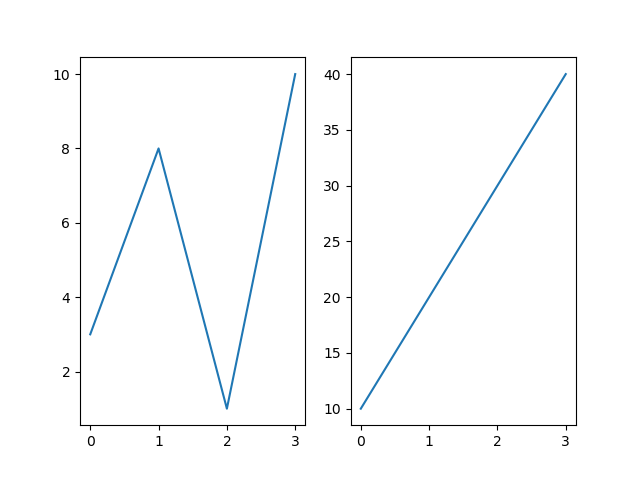

```python
import matplotlib.pyplot as plt
import numpy as np

#plot 1:
x = np.array([0, 1, 2, 3])
y = np.array([3, 8, 1, 10])

plt.subplot(2, 1, 1)
plt.plot(x,y)

#plot 2:
x = np.array([0, 1, 2, 3])
y = np.array([10, 20, 30, 40])

plt.subplot(2, 1, 2)
plt.plot(x,y)

plt.show()
```
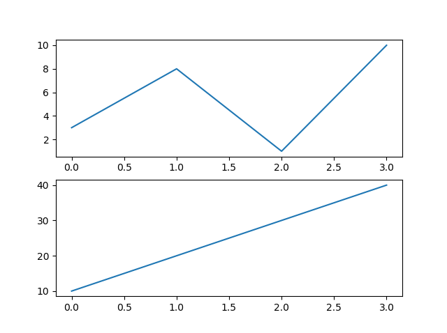

```pyhton
import matplotlib.pyplot as plt
import numpy as np

x = np.array([0, 1, 2, 3])
y = np.array([3, 8, 1, 10])

plt.subplot(2, 3, 1)
plt.plot(x,y)

x = np.array([0, 1, 2, 3])
y = np.array([10, 20, 30, 40])

plt.subplot(2, 3, 2)
plt.plot(x,y)

x = np.array([0, 1, 2, 3])
y = np.array([3, 8, 1, 10])

plt.subplot(2, 3, 3)
plt.plot(x,y)

x = np.array([0, 1, 2, 3])
y = np.array([10, 20, 30, 40])

plt.subplot(2, 3, 4)
plt.plot(x,y)

x = np.array([0, 1, 2, 3])
y = np.array([3, 8, 1, 10])

plt.subplot(2, 3, 5)
plt.plot(x,y)

x = np.array([0, 1, 2, 3])
y = np.array([10, 20, 30, 40])

plt.subplot(2, 3, 6)
plt.plot(x,y)

plt.show()
```
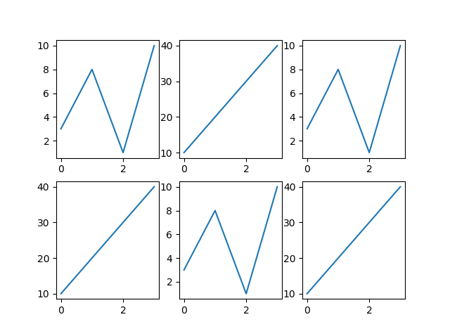


### Subplot Title
```python
import matplotlib.pyplot as plt
import numpy as np

#plot 1:
x = np.array([0, 1, 2, 3])
y = np.array([3, 8, 1, 10])

plt.subplot(1, 2, 1)
plt.plot(x,y)
plt.title("SALES")

#plot 2:
x = np.array([0, 1, 2, 3])
y = np.array([10, 20, 30, 40])

plt.subplot(1, 2, 2)
plt.plot(x,y)
plt.title("INCOME")

plt.show()
```
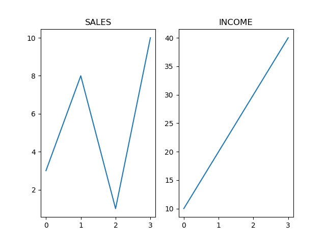

### Super Title
* We can add a title to the entire figure with the suptitle() function:
```python
import matplotlib.pyplot as plt
import numpy as np

#plot 1:
x = np.array([0, 1, 2, 3])
y = np.array([3, 8, 1, 10])

plt.subplot(1, 2, 1)
plt.plot(x,y)
plt.title("SALES")

#plot 2:
x = np.array([0, 1, 2, 3])
y = np.array([10, 20, 30, 40])

plt.subplot(1, 2, 2)
plt.plot(x,y)
plt.title("INCOME")

plt.suptitle("MY SHOP")
plt.show()
```
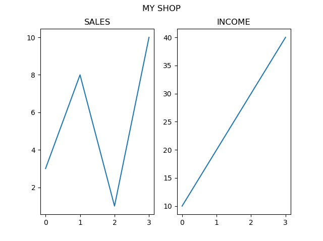


# Matplotlib Scatter
* We can use the **scatter() function** to draw a scatter plot.
* The **scatter() function** plots one dot for each observation. It needs two arrays of the same length, one for the values of the x-axis, and one for values on the y-axis:
```python
import matplotlib.pyplot as plt
import numpy as np

x = np.array([5,7,8,7,2,17,2,9,4,11,12,9,6])
y = np.array([99,86,87,88,111,86,103,87,94,78,77,85,86])

plt.scatter(x, y)
plt.show()
```
* The observation in the example above is the result of 13 cars passing by.
* The **X-axis shows** how **old** the **car** is.
* The **Y-axis shows** the **speed** of the **car** when it passes.
* Are there any relationships between the observations?
* It seems that the newer the car, the faster it drives, but that could be a coincidence, after all we only registered 13 cars.
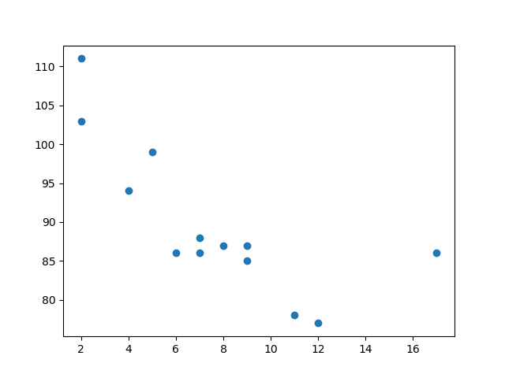

### Compare Plots
```python
import matplotlib.pyplot as plt
import numpy as np

#day one, the age and speed of 13 cars:
x = np.array([5,7,8,7,2,17,2,9,4,11,12,9,6])
y = np.array([99,86,87,88,111,86,103,87,94,78,77,85,86])
plt.scatter(x, y)

#day two, the age and speed of 15 cars:
x = np.array([2,2,8,1,15,8,12,9,7,3,11,4,7,14,12])
y = np.array([100,105,84,105,90,99,90,95,94,100,79,112,91,80,85])
plt.scatter(x, y)

plt.show()
```
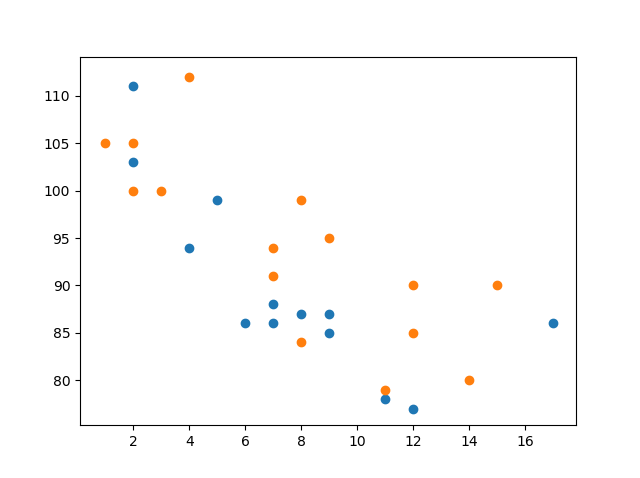

### Change Scatter Colors
```python
import matplotlib.pyplot as plt
import numpy as np

x = np.array([5,7,8,7,2,17,2,9,4,11,12,9,6])
y = np.array([99,86,87,88,111,86,103,87,94,78,77,85,86])
plt.scatter(x, y, color = 'hotpink')

x = np.array([2,2,8,1,15,8,12,9,7,3,11,4,7,14,12])
y = np.array([100,105,84,105,90,99,90,95,94,100,79,112,91,80,85])
plt.scatter(x, y, color = '#88c999')

plt.show()
```
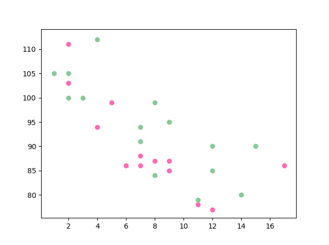

### **Color Each Dot**
```python
import matplotlib.pyplot as plt
import numpy as np

x = np.array([5,7,8,7,2,17,2,9,4,11,12,9,6])
y = np.array([99,86,87,88,111,86,103,87,94,78,77,85,86])
colors = np.array(["red","green","blue","yellow","pink","black","orange","purple","beige","brown","gray","cyan","magenta"])

plt.scatter(x, y, c=colors)

plt.show()
```
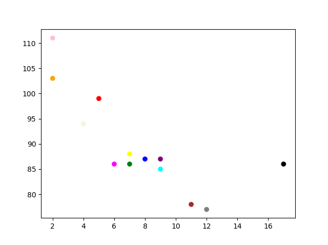

### **How to Use the ColorMap**
```python
import matplotlib.pyplot as plt
import numpy as np

x = np.array([5,7,8,7,2,17,2,9,4,11,12,9,6])
y = np.array([99,86,87,88,111,86,103,87,94,78,77,85,86])
colors = np.array([0, 10, 20, 30, 40, 45, 50, 55, 60, 70, 80, 90, 100])

plt.scatter(x, y, c=colors, cmap='viridis')

plt.colorbar()

plt.show()
```
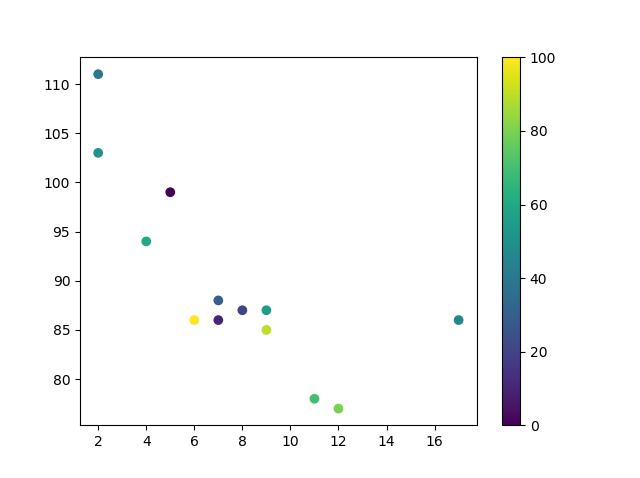

```python
import matplotlib.pyplot as plt
import numpy as np

x = np.array([5,7,8,7,2,17,2,9,4,11,12,9,6])
y = np.array([99,86,87,88,111,86,103,87,94,78,77,85,86])
colors = np.array([0, 10, 20, 30, 40, 45, 50, 55, 60, 70, 80, 90, 100])

plt.scatter(x, y, c=colors, cmap='viridis')

plt.show()
```
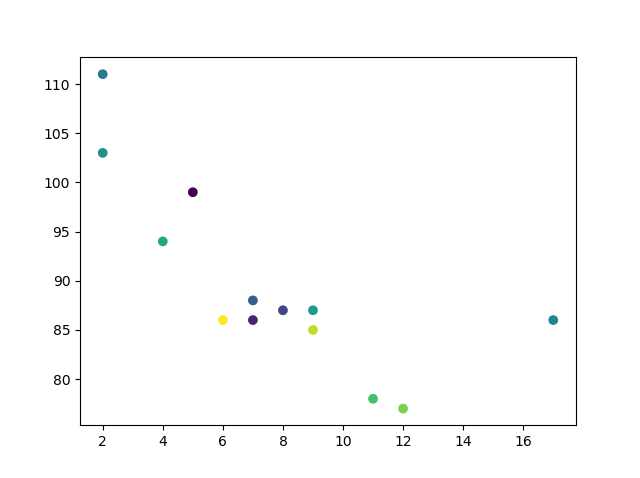

### **Change Scatter Size**
* You can change the size of the dots with the **s** argument.
```python
import matplotlib.pyplot as plt
import numpy as np

x = np.array([5,7,8,7,2,17,2,9,4,11,12,9,6])
y = np.array([99,86,87,88,111,86,103,87,94,78,77,85,86])
sizes = np.array([20,50,100,200,500,1000,60,90,10,300,600,800,75])

plt.scatter(x, y, s=sizes)

plt.show()
```

### **Alpha**
* We can adjust the **transparency** of the dots with the alpha argument.
```python
import matplotlib.pyplot as plt
import numpy as np

x = np.array([5,7,8,7,2,17,2,9,4,11,12,9,6])
y = np.array([99,86,87,88,111,86,103,87,94,78,77,85,86])
sizes = np.array([20,50,100,200,500,1000,60,90,10,300,600,800,75])

plt.scatter(x, y, s=sizes, alpha=0.5)

plt.show()
```

### **Combine Color Size and Alpha**
```python
import matplotlib.pyplot as plt
import numpy as np

x = np.random.randint(100, size=(100))
y = np.random.randint(100, size=(100))
colors = np.random.randint(100, size=(100))
sizes = 10 * np.random.randint(100, size=(100))

plt.scatter(x, y, c=colors, s=sizes, alpha=0.5, cmap='nipy_spectral')

plt.colorbar()

plt.show()
```
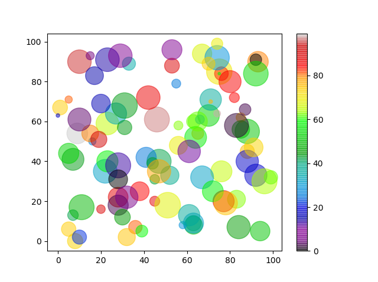


# Matplotlib Bars
### Creating Bars
* We can use the **bar() function** to draw bar graphs.
```python
import matplotlib.pyplot as plt

x=["python","C++","C","php"]
y =[2,4,8,6]

plt.bar(x,y)
plt.show()
```
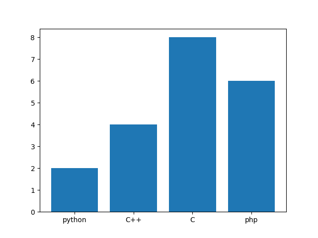

### **Horizontal Bars**
* If you want the bars to be displayed horizontally instead of vertically, use the **barh()** function:
```python
import matplotlib.pyplot as plt

x=["python","C++","C","php"]
y =[2,4,8,6]

plt.bar(x,y)
plt.show()
```
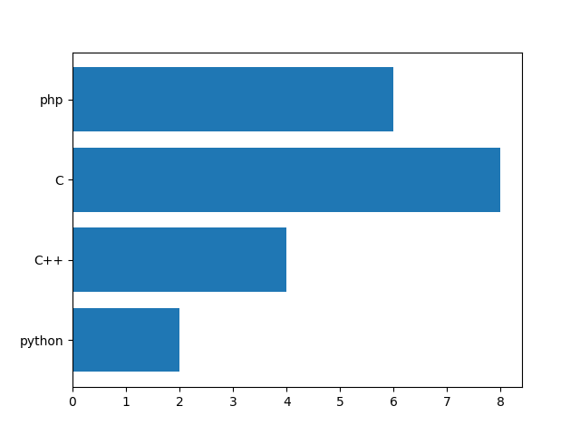

* Bar color for single
```python
plt.bar(x,y, color="y")
```

* Multipal color
col = ['r','y','g','b']
plt.bar(x,y,width=0.4, color="col")

* Bar Width
  * The **bar()** takes the keyword argument **width** to set the width of the bars:
```python
plt.bar(x, y, width = 0.1)
```
  * The **barh()** takes the keyword argument **height** to set the height of the bars:
```python
plt.barh(x, y, height = 0.1)
```

###  **Bar color**
```python
# single color
plt.bar(x,y,width=0.4, color="y")

# multipal color
col = ['r','y','g','b']
plt.bar(x,y,width=0.4, color="col")
```

### **Align bar chart:-** By default center
```python
plt.bar(x,y,width=0.4, align="edge")    # for left
plt.bar(x,y,width=0.4, align="center") # for center
```

### **Boundary**
```python
# Boundary
plt.bar(x,y,width=0.4, edgecolor="r")

# for border width
plt.bar(x,y,width=0.4, edgecolor="r", linewidth="10")

# Boundary line style
plt.bar(x,y,width=0.4, edgecolor="r", linewidth="10", linestyle=":")

# Boundary line style ko halka karna ho to
plt.bar(x,y,width=0.4, edgecolor="r", linewidth="10", linestyle=":", alpha="0.4")
```


```python
# bar chart ka label
plt.bar(x,y,width=0.4, edgecolor="r", label="python")
plt.legend()
plt.show()


# two bar graph overlap
import matplotlib.pyplot as plt
import numpy as np

x=["python","C++","C","php"]
y =[8,4,6,7]
z =[4,2,4,3]

c = ['r','y','g','b']

plt.xlabel("language", fontsize="40")
plt.ylabel("no", fontsize="30")
plt.title("mohit", fontsize="20")
#plt.bar(x,y,width=0.4,color="r", label=)
plt.bar(x,y,width=0.4, color="r", label="python1")
plt.bar(x,z,width=0.4, color="y", label="python2")
plt.legend()
plt.show()

# two bar code without overlap
```
<div style="page-break-before: always;"></div>

# Matplotlib Pie Charts
### **Creating Pie Charts**
* we can use the **pie() function** to draw pie charts.
```python
import matplotlib.pyplot as plt
import numpy as np

y = np.array([35, 25, 25, 15])

plt.pie(y)
plt.show()
```
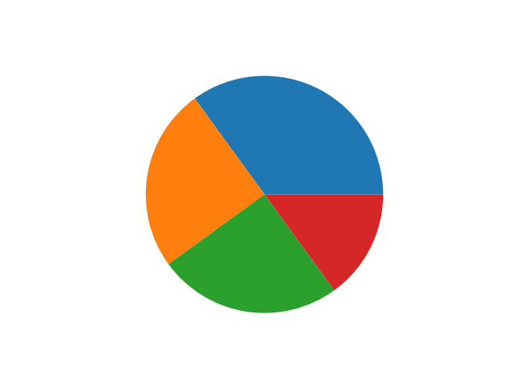
<div style="page-break-before: always;"></div>

### **Pie Labels**
```python
y = np.array([35, 25, 25, 15])
mylabels = ["Apples", "Bananas", "Cherries", "Dates"]

plt.pie(y, labels = mylabels)
plt.show() 
```
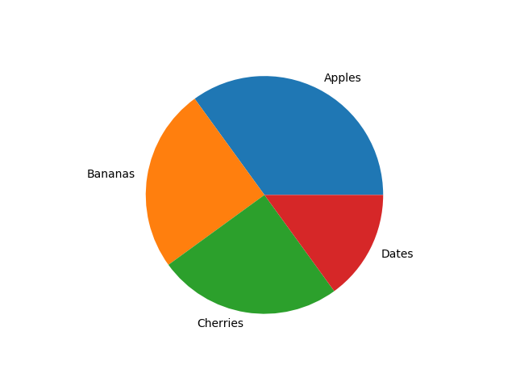

### **Pie Start Angle**
* As mentioned the **default start angle** is at the **x-axis**, but we can change the start angle by specifying a startangle parameter.
* The startangle parameter is defined with an angle in degrees, default angle is 0:
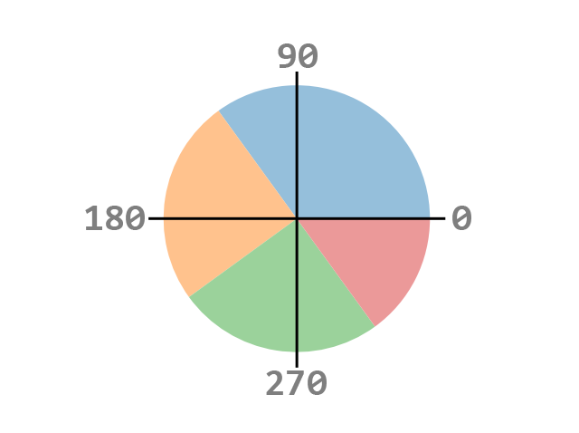

```python
y = np.array([35, 25, 25, 15])
mylabels = ["Apples", "Bananas", "Cherries", "Dates"]

plt.pie(y, labels = mylabels, startangle = 90)
plt.show()
```
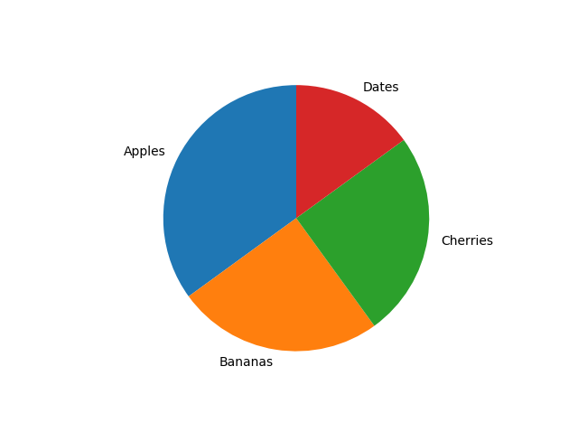

### **Pie Explode**
* Maybe you want one of the wedges to stand out? The explode parameter allows you to do that.
* The explode parameter, if specified, and not None, must be an array with one value for each wedge.
* Each value represents how far from the center each wedge is displayed:
```python
import matplotlib.pyplot as plt
import numpy as np

y = np.array([35, 25, 25, 15])
mylabels = ["Apples", "Bananas", "Cherries", "Dates"]
myexplode = [0.2, 0, 0, 0]

plt.pie(y, labels = mylabels, explode = myexplode)
plt.show() 
```
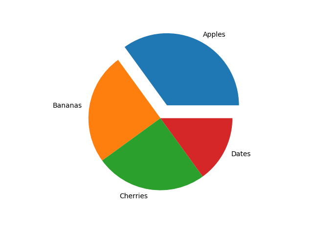

### **Pie Shadow**
```python
import matplotlib.pyplot as plt
import numpy as np

y = np.array([35, 25, 25, 15])
mylabels = ["Apples", "Bananas", "Cherries", "Dates"]
myexplode = [0.2, 0, 0, 0]

plt.pie(y, labels = mylabels, explode = myexplode, shadow = True)
plt.show() 
```
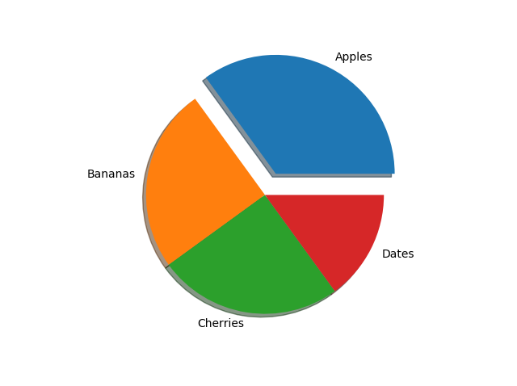

### **Pie colors**
```python
import matplotlib.pyplot as plt
import numpy as np

y = np.array([35, 25, 25, 15])
mylabels = ["Apples", "Bananas", "Cherries", "Dates"]
mycolors = ["black", "hotpink", "b", "#4CAF50"]

plt.pie(y, labels = mylabels, colors = mycolors)
plt.show()
```
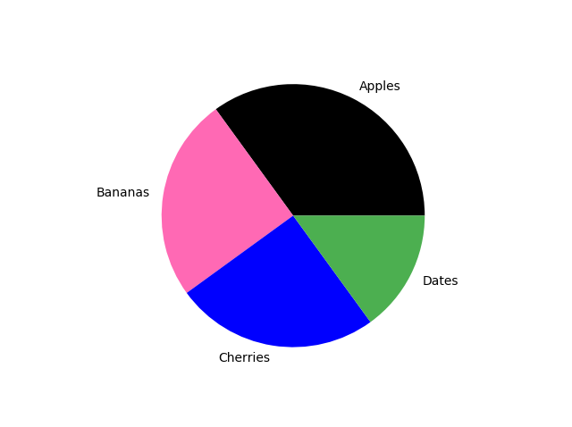

### **Pie Legend**
* To add a list of explanation for each wedge, use the legend() function:
```python
import matplotlib.pyplot as plt
import numpy as np

y = np.array([35, 25, 25, 15])
mylabels = ["Apples", "Bananas", "Cherries", "Dates"]

plt.pie(y, labels = mylabels)
plt.legend()
plt.show() 
```
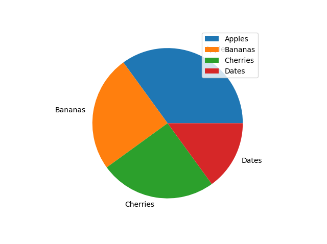

```python
plt.pie(y, labels = mylabels)
plt.legend(title = "Four Fruits:")
plt.show()
```

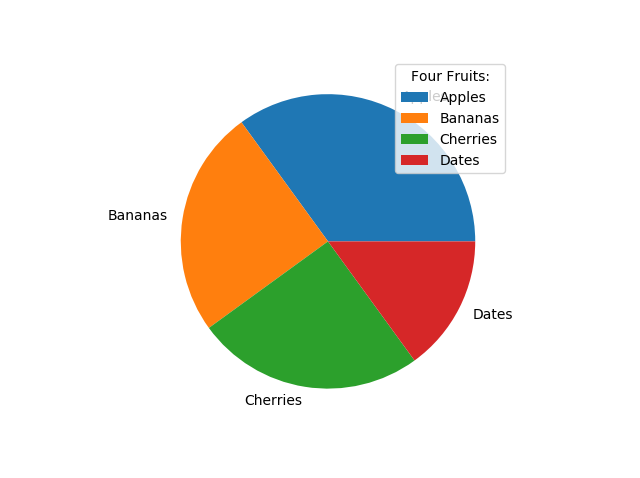