### **What is Matplotlib?**
* Matplotlib is a low level graph plotting library in python that serves as a visualization utility.
* Matplotlib was created by **John D. Hunter**.
* Matplotlib is open source and we can use it freely.
* Matplotlib is mostly written in python, a few segments are written in C, Objective-C and Javascript for Platform compatibility.

### **Installation of Matplotlib**
```python
pip install matplotlib
```

### **Import Matplotlib**
```python
import matplotlib
```

### **Checking Matplotlib Version**
```python
import matplotlib

print(matplotlib.__version__)   # Output:- 2.0.0
```
<div style="page-break-before: always;"></div>

### **Pyplot Example**
```python
# Exmaple 1
import matplotlib.pyplot as plt
import numpy as np

xpoints = np.array([0, 6])
ypoints = np.array([0, 250])

plt.plot(xpoints, ypoints)
plt.show()
```
<!-- 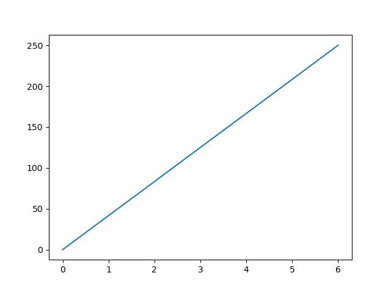 -->
<!--  -->

<div style="page-break-before: always;"></div>

```python
# Example 2
import matplotlib.pyplot as plt
import numpy as np

xpoints = np.array([1, 8])
ypoints = np.array([3, 10])

plt.plot(xpoints, ypoints)
plt.show()
```

<div style="page-break-before: always;"></div>

### **Plotting Without Line Example**
```python
import matplotlib.pyplot as plt
import numpy as np

xpoints = np.array([1, 8])
ypoints = np.array([3, 10])

plt.plot(xpoints, ypoints, 'o')
plt.show()
```
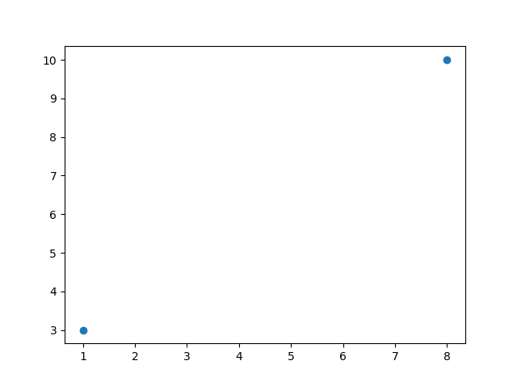

### **Multiple Points**
* Draw a line in a diagram from position (1, 3) to (2, 8) then to (6, 1) and finally to position (8, 10):
```python
import matplotlib.pyplot as plt
import numpy as np

xpoints = np.array([1, 2, 6, 8])
ypoints = np.array([3, 8, 1, 10])

plt.plot(xpoints, ypoints)
plt.show()
```
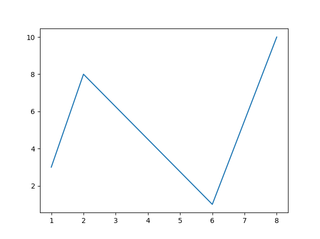

### **Default X-Points**
```python
import matplotlib.pyplot as plt
import numpy as np

ypoints = np.array([3, 8, 1, 10, 5, 7])

plt.plot(ypoints)
plt.show()
```
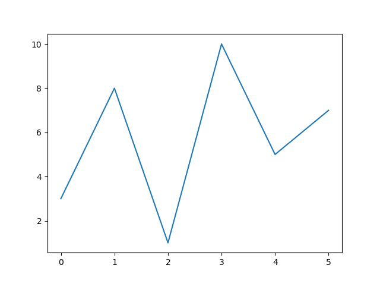

### **Matplotlib Markers**
```python
import matplotlib.pyplot as plt
import numpy as np

ypoints = np.array([3, 8, 1, 10])

plt.plot(ypoints, marker = 'o')
plt.show()
```
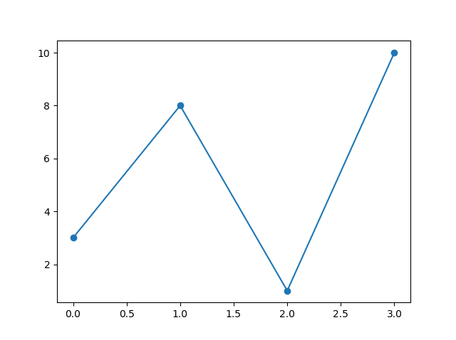

```python
plt.plot(ypoints, marker = '*')
plt.show()
```
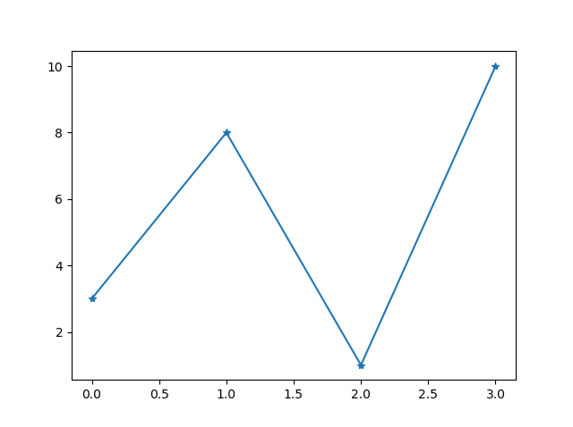

#### Marker Reference
| Marker | Description    |
| :----: | -------------- |
|  'o'   | Circle         |
|  '*'   | Star           |
|  '.'   | Point          |
|  ','   | Pixel          |
|  'x'   | X              |
|  'X'   | X (filled)     |
|  '+'   | Plus           |
|  'P'   | Plus (filled)  |
|  's'   | Square         |
|  'D'   | Diamond        |
|  'd'   | Diamond (thin) |
|  'p'   | Pentagon       |
|  'H'   | Hexagon        |
|  'h'   | Hexagon        |
|  'v'   | Triangle Down  |
|  '^'   | Triangle Up    |
|  '<'   | Triangle Left  |
|  '>'   | Triangle Right |
|  '1'   | Tri Down       |
|  '2'   | Tri Up         |
|  '3'   | Tri Left       |
|  '4'   | Tri Right      |
|  '!'   | Vline          |
|  '_'   | Hline          |

### **Format Strings fmt**
* You can also use the shortcut string notation parameter to specify the marker.
* This parameter is also called fmt, and is written with this **syntax:** marker|line|color

#### Line Reference

| Line Syntax | Description         |
| :---------: | ------------------- |
|     '-'     | Solid line(default) |
|     ':'     | Dotted line         |
|    '--'     | Dashed line         |
|    '-.'     | Dashed/dotted line  |

#### Color Reference
| Color Syntax | Description |
| :----------: | ----------- |
|     'r'      | Red         |
|     'g'      | Green       |
|     'b'      | Blue        |
|     'c'      | Cyan        |
|     'm'      | Magenta     |
|     'y'      | Yellow      |
|     'k'      | Black       |
|     'w'      | White       |

```python
import matplotlib.pyplot as plt
import numpy as np

ypoints = np.array([3, 8, 1, 10])

plt.plot(ypoints, 'o:r')    # o menas circule / r means red
plt.show()
```
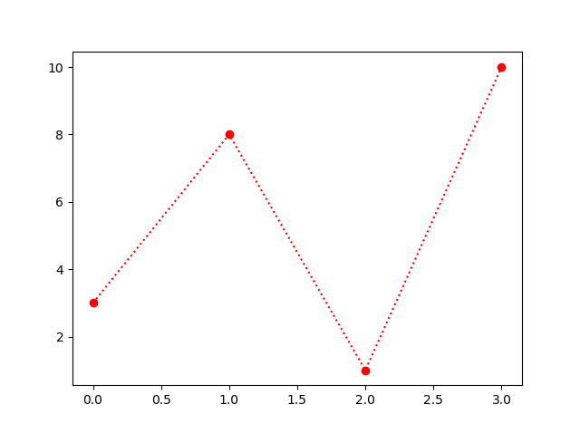

### **Marker Size**
* You can use the keyword argument **markersize** or the shorter version, **ms** to set the size of the markers:
```python
import matplotlib.pyplot as plt
import numpy as np

ypoints = np.array([3, 8, 1, 10])

plt.plot(ypoints, marker = 'o', ms = 20)
plt.show()
```
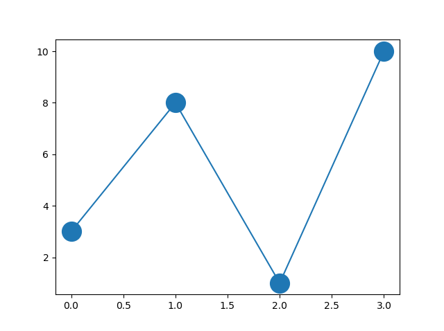

### **Marker Color**
* You can use the keyword argument **markeredgecolor** or the shorter **mec** to set the color of the edge of the markers:
```python
import matplotlib.pyplot as plt
import numpy as np

ypoints = np.array([3, 8, 1, 10])

plt.plot(ypoints, marker = 'o', ms = 20, mec = 'r')
plt.show()
```
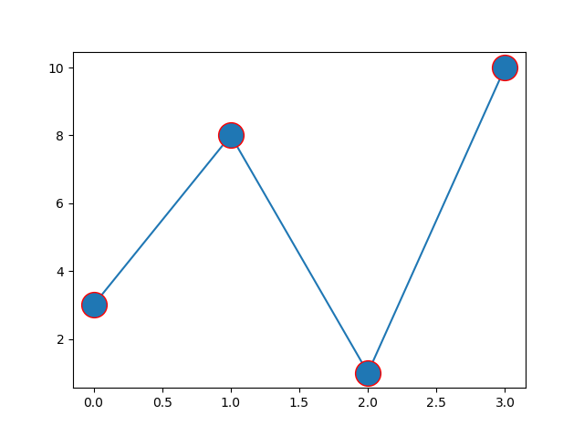

* You can use the keyword argument **markerfacecolor** or the shorter **mfc** to set the color inside the edge of the markers:
```python
import matplotlib.pyplot as plt
import numpy as np

ypoints = np.array([3, 8, 1, 10])

plt.plot(ypoints, marker = 'o', ms = 20, mfc = 'r')
plt.show()
```
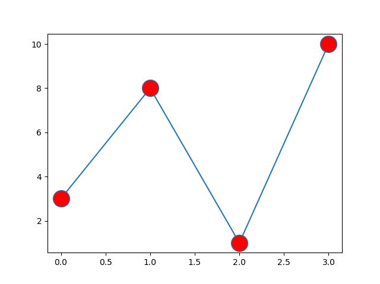

* Use **both** the **mec** and **mfc** arguments to color the entire marker:
```python
import matplotlib.pyplot as plt
import numpy as np

ypoints = np.array([3, 8, 1, 10])

plt.plot(ypoints, marker = 'o', ms = 20, mec = 'r', mfc = 'r')
plt.show()
```
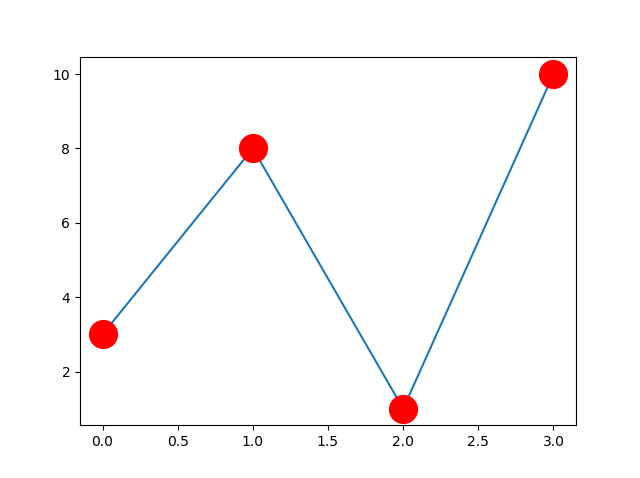

* We can also **use** **Hexadecimal** **color** values:
```python
import matplotlib.pyplot as plt
import numpy as np

ypoints = np.array([3, 8, 1, 10])

plt.plot(ypoints, marker = 'o', ms = 20, mec = '#4CAF50', mfc = '#4CAF50')
plt.show()
```
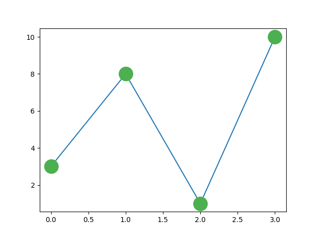

* We can also **use** **color names** values: (https://www.w3schools.com/colors/colors_names.asp)
```python
plt.plot(ypoints, marker = 'o', ms = 20, mec = 'hotpink', mfc = 'hotpink')
```
<div style="page-break-before: always;"></div>

# Matplotlib Line
* You can use the keyword argument **linestyle**, or shorter **ls**, to change the style of the plotted line.

| Line Syntax | Description             |
| :---------: | ----------------------- |
|     '-'     | Solid line(default)     |
|     ':'     | Dotted line             |
|    '--'     | Dashed line             |
|    '-.'     | Dashed/dotted line      |
|  '' or ' '  | 'None'    (Blank Graph) |

```python
# dotted can be written as :.
plt.plot(ypoints, linestyle = 'dotted') / plt.plot(ypoints, linestyle = ':')
plt.plot(ypoints, ls = 'dotted') / plt.plot(ypoints, ls = ':')

# and so on
```

```python
import matplotlib.pyplot as plt
import numpy as np

ypoints = np.array([3, 8, 1, 10])

plt.plot(ypoints, linestyle = 'dotted')
plt.show()
```
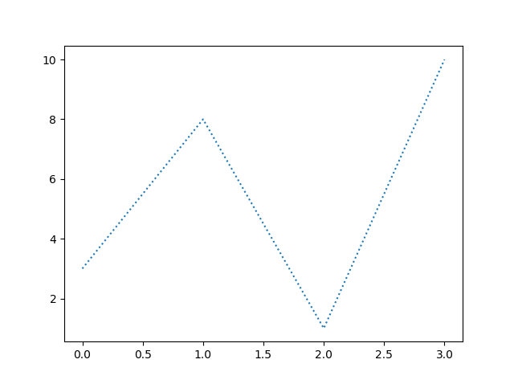

# Line Color
* You can use the keyword argument **color** or the shorter **c** to set the color of the line:
```python
import matplotlib.pyplot as plt
import numpy as np

ypoints = np.array([3, 8, 1, 10])

plt.plot(ypoints, color = 'r')  # using color
plt.plot(ypoints, color = '#4CAF50')  # using Hexadecimal color
plt.plot(ypoints, color = 'hotpink')  # using color name

plt.show()
```
<div style="page-break-before: always;"></div>

# Line Width
* You can use the keyword argument **linewidth** or the shorter **lw** to change the width of the line.
```python
import matplotlib.pyplot as plt
import numpy as np

ypoints = np.array([3, 8, 1, 10])

plt.plot(ypoints, linewidth = '20.5')
plt.show()
```
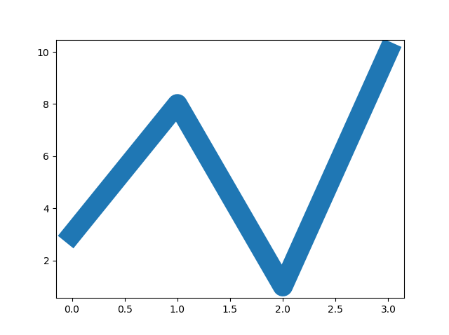
<div style="page-break-before: always;"></div>

# Multiple Lines
* You can plot as many lines as you like by simply adding more **plt.plot()** functions:
```python
import matplotlib.pyplot as plt
import numpy as np

y1 = np.array([3, 8, 1, 10])
y2 = np.array([6, 2, 7, 11])

plt.plot(y1)
plt.plot(y2)

plt.show()
```
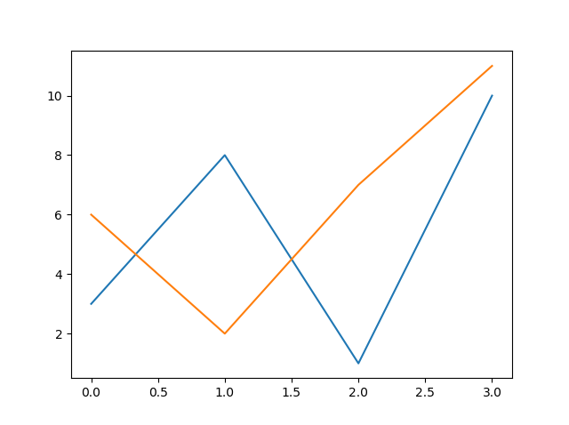

* You can also plot many lines by adding the points for the x- and y-axis for each line in the same plt.plot() function.
```python
import matplotlib.pyplot as plt
import numpy as np

x1 = np.array([0, 1, 2, 3])
y1 = np.array([3, 8, 1, 10])
x2 = np.array([0, 1, 2, 3])
y2 = np.array([6, 2, 7, 11])

plt.plot(x1, y1, x2, y2)
plt.show()
```


# Matplotlib Labels and Title
* we can use the **xlabel()** and **ylabel()** functions to **set** a label for the x- and y-axis.
* we can use the **title()** function to **set** a **title** for the plot.
```python
import numpy as np
import matplotlib.pyplot as plt

x = np.array([80, 85, 90, 95, 100, 105, 110, 115, 120, 125])
y = np.array([240, 250, 260, 270, 280, 290, 300, 310, 320, 330])

plt.plot(x, y)

plt.title("Sports Watch Data")
plt.xlabel("Average Pulse")
plt.ylabel("Calorie Burnage")

plt.show()
```
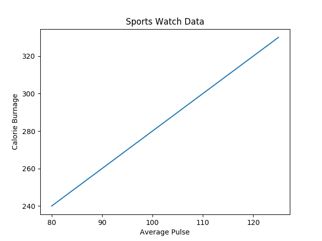

### **Set Font Properties for Title and Labels**
* You can use the fontdict parameter in xlabel(), ylabel(), and title() to set font properties for the title and labels.
```python
import numpy as np
import matplotlib.pyplot as plt

x = np.array([80, 85, 90, 95, 100, 105, 110, 115, 120, 125])
y = np.array([240, 250, 260, 270, 280, 290, 300, 310, 320, 330])

font1 = {'family':'serif','color':'blue','size':20}
font2 = {'family':'serif','color':'darkred','size':15}

plt.title("Sports Watch Data", fontdict = font1)
plt.xlabel("Average Pulse", fontdict = font2)
plt.ylabel("Calorie Burnage", fontdict = font2)

plt.plot(x, y)
plt.show()
```
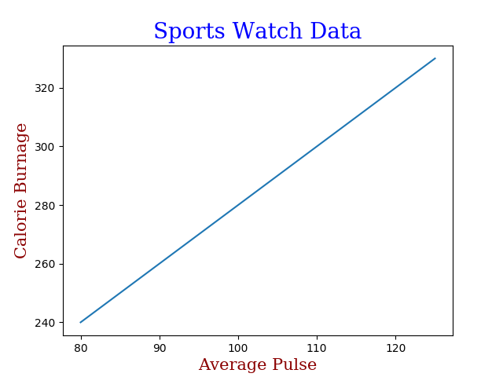

### **Position the Title**
* You can use the **loc** parameter in title() to position the title.
* Legal values are: '**left**', '**right**', and '**center**'. Default value is 'center'.
```python
import numpy as np
import matplotlib.pyplot as plt

x = np.array([80, 85, 90, 95, 100, 105, 110, 115, 120, 125])
y = np.array([240, 250, 260, 270, 280, 290, 300, 310, 320, 330])

plt.title("Sports Watch Data", loc = 'left')
plt.xlabel("Average Pulse")
plt.ylabel("Calorie Burnage")

plt.plot(x, y)
plt.show()
```
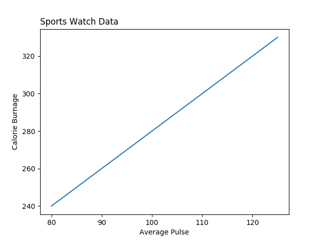

# Matplotlib Adding Grid Lines